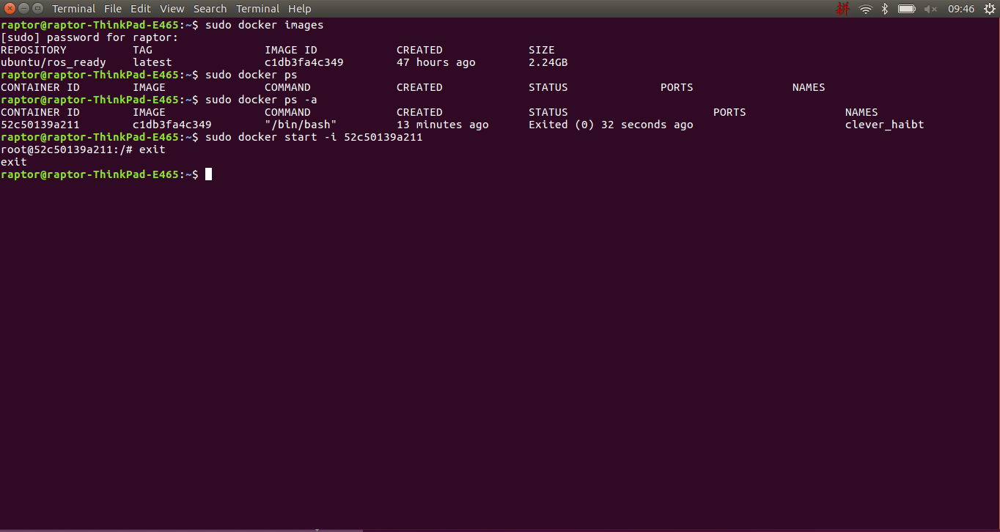

## 一.Docker 镜像 容器 虚拟机等概念介绍
### docker概念：
docker可以理解为一台虚拟机，就像VMware一样，在上面可以安装系统。具体做法是：先做好镜像（image）文件，然后根据镜像生成容器（镜像实例化），容器可以是多个。不同的容器中再根据需要安装需要的软件，比如ros等。  
每一个容器都是相互独立的（就像不同电脑上装的同一个系统一样），而容器又是一个虚拟的docker，在这个docker下又可以创建镜像和新的子容器...理论上可以一直往下创建，一层一层创建   

### docker中的镜像：
就是打包好的系统文件（也可能携带事先安装好的部分应用程序软件.exe文件），该镜像文件可以自己创建，也可以远程端（需联网）下载别人已经打包好的镜像文件，或者在没有网的情况下，从别人的本地库拷贝事先生成的线下镜像文件（.taz格式）  

### 自己创建系统镜像文件的大致方法：
1.配置系统文件说明  
2.链接下载好需要镜像的系统源文件  
3.再通过一系列命令对系统源文件进行打包配置，最后生成最终的镜像系统文件。  

#### 提示：自己创建系统镜像文件较为复杂，一般是远程下载或者线下拷贝并导入。

## 二.安装docker（基于ubuntu16.04）
安装步骤：  
1.  
2.  

安装docker官网教程https://docs.docker.com/install/linux/docker-ce/ubuntu/  

## 三.docker常用命令：
sudo docker version或者sudo docker -v：查看安装好的docker信息  
sudo docker load -i  ./xxx.tar ： 将tar包导入为本地镜像  
sudo docker images 或者sudo docker image ls ：列出所有镜像  
sudo docker run -it ID或name ：创建并启动容器（ID就是已经导入的镜像ID）  
sudo docker ps -a ：查看已经创建的所有容器，包括停止的  
sudo docker ps -s ：查看当前运行的容器  
sudo docker ps -l ：查看最后一次创建并运行的容器  
sudo docker ps -n ：-n=x选项，会列出最后创建的x个容器。  
sudo docker stop ID或name ：停止容器(stop给与一定的关闭时间交由容器自己保存状态，称为优雅的停止)  
sudo docker kill ID或name ：直接关闭容器  
sudo docker rm ID或name    ：删除容器  
sudo docker rmi ID或name ：删除镜像  
#### 注意：
步骤：导入镜像（download），创建并启动容器（run），然后进入实例化的容器系统（即ubuntu系统），可通过stop或者kill暂停关闭容器。如果要退出容器，就用exit。若要重新启动容器，就是用start，见下图。  
  

1.停止所有的container，这样才能够删除其中的images：  

docker stop $(docker ps -a -q)  

如果想要删除所有container的话再加一个指令：  

docker rm $(docker ps -a -q)  

2.查看当前有些什么images  

docker images  

3.删除images，通过image的id来指定删除谁  

docker rmi <image id>  

想要删除untagged images，也就是那些id为<None>的image的话可以用  

docker rmi $(docker images | grep "^<none>" | awk "{print $3}")  

要删除全部image的话  

docker rmi $(docker images -q)  
